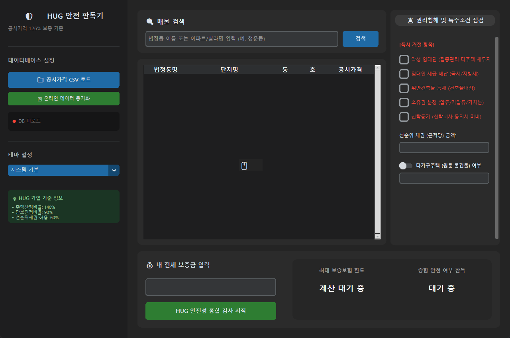

# HUG 전세보증금 안전 판독기

공동주택공시가격 데이터를 바탕으로 HUG 전세보증보험 가입 기준(126% 룰) 및 권리침해 요건을 대조하여 안전 여부를 판독해주는 데스크톱 프로그램입니다.

---

## 주요 기능
- **제한물권 필터링**: 악성 임대인, 세금 체납, 위반건축물, 압류/가압류, 신탁등기, 가등기, 선순위 전세권 등 가입 거절 요건 검증
- **다가구주택 및 선순위 임차보증금 계산**: 다가구 주택 선택 시 타 세입자들의 보증금을 합산하여 가입 한도 초과 여부 계산
- **선순위 채권 검증**: 근저당권 등 선순위 채권이 주택 가격의 60%를 초과하는지 여부 판별
- **온라인 데이터 동기화**: 버튼 클릭 한 번으로 국토교통부 주택 공시가격 정보를 온라인에서 실시간으로 내려받아 로드
- **해상도 최적화**: 모니터의 해상도나 창 크기 조절에 맞춰 인터페이스 요소들이 깔끔하게 조정되는 유동적 레이아웃

---

## 작동 화면

### 🔄 온라인 공공데이터 동기화
> 온라인 원격 저장소로부터 실시간으로 주택 공시가격 정보를 동기화하고 캐싱하는 과정입니다. 네트워크 연결이 끊겨도 로컬 캐시를 로드하여 안정적으로 동작합니다.

### 🟢 정상 가입 조건 판독
> 공시가격 대비 적정 전세금을 입력하여 안전(녹색) 판정을 받는 예시입니다.

### 🔴 가입 불가능 조건 판독 (즉시 거절)
> 보증 한도와 무관하게 권리침해 요건(예: 악성 임대인 설정 등)에 해당하여 즉각 거절(적색) 판정을 받는 예시입니다.

### 🏢 다가구주택 보증금 합산 검증
> 다가구주택(원룸 통건물) 선택 시 타 세입자 보증금 입력창이 활성화되며, 합산액이 한도를 초과할 경우 거절 처리됩니다.

### 💸 선순위 근저당 비율 검사
> 근저당(선순위 채권)이 주택 가격의 60%를 초과할 경우 가입 불가 처리가 이루어집니다.

### 🌗 다크/라이트 테마 자동 동기화
> 시스템 기본값, 다크 모드, 라이트 모드로 실시간으로 프레임과 표(Treeview) 디자인이 동기화됩니다.

---

## 데이터 연동 방식
- **온라인 하이브리드 연동**: 국토교통부의 공동주택 공시가격 데이터(샘플 및 실데이터)를 온라인 원격 저장소로부터 다운로드하여 로드합니다.
- **오프라인 캐싱 및 예외 처리**: 사용자가 최초 1회 온라인으로 동기화하거나 로컬 CSV 파일을 직접 불러오면 로컬 캐시에 저장되며, 네트워크가 잡히지 않는 오프라인 상황에서도 캐싱된 오프라인 데이터베이스를 활용해 판독 작업을 정상 수행할 수 있습니다.

---

## 기술 구성
- **사용 언어**: Python 3.10+
- **인터페이스**: CustomTkinter
- **데이터 분석 및 매칭**: Pandas

---

## 사용 방법
1. 좌측 사이드바의 **'온라인 데이터 동기화'** 또는 **'공시가격 CSV 로드'**를 클릭하여 데이터를 로드합니다.
2. 매물 검색창에 법정동 또는 단지명을 입력하여 대상 매물을 선택합니다.
3. 우측의 체크리스트에서 임대인 체납 정보, 위반건축물 여부, 선순위 근저당 금액 등 매물의 상세 권리 관계를 설정합니다.
4. 현재 전세금을 입력한 뒤 **'HUG 안전성 종합 검사 시작'**을 클릭하여 결과를 확인합니다.
