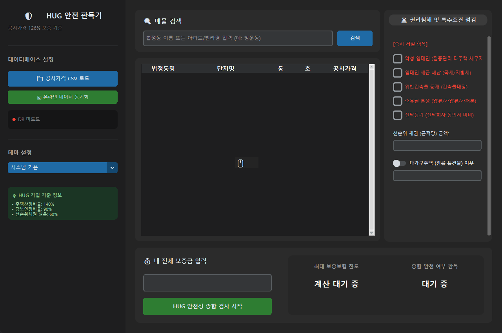

<h1 align="center">🛡️ HUG 전세보증금 안전 판독기</h1>

<p align="center">
  <strong>공동주택공시가격 데이터를 바탕으로 HUG 전세보증보험 가입 기준(126% 룰) 및<br/>
  각종 권리침해 요건을 대조하여 매물의 안전 여부를 판독해주는 데스크톱 프로그램입니다.</strong>
</p>

<p align="center">
  
  
  
  
  
</p>

---

## 📋 목차

1. [프로그램 소개](#프로그램-소개)
2. [시스템 요구 사양](#시스템-요구-사양)
3. [주요 기능](#주요-기능)
4. [주요 작동 화면](#주요-작동-화면)
5. [시스템 아키텍처](#시스템-아키텍처)
6. [기술 스택](#기술-스택)
7. [디렉토리 구조](#디렉토리-구조)
8. [실행 방법](#실행-방법)
9. [데이터 연동 및 설정 가이드](#데이터-연동-및-설정-가이드)

---

## 💡 프로그램 소개

**HUG 전세보증금 안전 판독기**는 전세 사기 예방과 안전한 임대차 계약을 위해 HUG(주택도시보증공사)의 전세보증보험 가입 요건을 직관적으로 검증해주는 데스크톱 애플리케이션입니다.

개정된 HUG 보증 규정인 **126% 룰(공시가격의 140% × 담보인정비율 90%)**을 기반으로 임차하고자 하는 매물의 보증 한도를 계산합니다. 또한, 악성 임대인 명단 조회, 국세 및 지방세 체납, 소유권 침해(압류/가압류/가처분 등), 위반건축물 여부와 같은 치명적인 권리침해 요건을 원클릭으로 검증합니다. 

특히 다가구주택의 누적 임차보증금 계산 및 선순위 근저당 비율 검사(주택가액의 60% 제한) 등 복잡한 조건들을 정밀하게 연산하여, 전세 계약 전 매물의 실제 보증 가능 여부를 명확한 안전/위험 신호로 즉시 판독해 줍니다.

---

## 💻 시스템 요구 사양

프로그램 구동을 위한 최소 및 권장 사양입니다.

| 구분 | 최소 사양 (Minimum) | 권장 사양 (Recommended) |
| :--- | :--- | :--- |
| **OS** | Windows 10/11, macOS 11+, Linux | Windows 10/11 (64-bit), macOS 12+, 최신 Linux |
| **CPU** | Dual-Core 2.0GHz 이상 | Quad-Core 2.5GHz 이상 |
| **RAM** | 4GB 이상 | 8GB 이상 |
| **저장공간** | SSD 여유 공간 1GB 이상 | SSD 여유 공간 2GB 이상 |
| **Python** | 3.10 이상 | 3.10 또는 3.11 |

---

## 🚀 주요 기능

- **HUG 가입 기준 자동 심사 (126% 룰)**: 주택산정비율(140%)과 담보인정비율(90%)을 결합한 HUG 보증 가입 적격 여부 자동 연산.
- **권리침해 즉시 거절 필터링**: 악성 임대인(집중관리 다주택 채무자), 임대인 세금 체납, 위반건축물 등재, 소유권 분쟁(압류/가압류/가처분 등), 신탁등기 여부 등의 즉시 거절 사유 검증.
- **선순위 근저당 비율 검사**: 선순위 채권(근저당 등)이 주택 가격(공시가격 × 1.4)의 60%를 초과하는지 여부를 정밀 분석하여 가입 불가 여부 판정.
- **다가구주택 보증금 누적 계산**: 다가구 주택 여부 체크 시 타 세입자들의 보증금 총액 입력창이 활성화되며, 합산액이 주택 전체 한도를 초과할 경우 경고 및 거절 처리.
- **온라인/오프라인 하이브리드 데이터 연동**: 국토교통부 OpenAPI를 통한 실시간 주택공시가격 동기화 및 로컬 캐싱 지원. 오프라인 상태에서도 캐시 데이터 기반 정상 구동.
- **비동기 데이터 로드 및 UI 렌더링**: 대용량 CSV 로드 시 GIL(Global Interpreter Lock)을 주기적으로 양보(Yield)하는 비동기 스레딩(Threading & `time.sleep`) 설계를 적용하여 로드 중 UI가 멈추는 현상(Stuttering)을 완벽히 방지.
- **다크/라이트 테마 자동 동기화**: OS 테마 및 CustomTkinter UI 테마(System, Dark, Light) 실시간 감지 및 Treeview 스타일링 동기화.

---

## 🎬 주요 작동 화면

### 🔄 온라인 공공데이터 동기화
> 온라인 원격 저장소로부터 실시간으로 주택 공시가격 정보를 동기화하고 캐싱하는 과정입니다. 네트워크 연결이 끊겨도 로컬 캐시를 로드하여 안정적으로 동작합니다.


### 🟢 정상 가입 조건 판독
> 공시가격 대비 적정 전세금을 입력하여 안전(녹색) 판정을 받는 예시입니다.


### 🔴 가입 불가능 조건 판독 (즉시 거절)
> 보증 한도와 무관하게 권리침해 요건(예: 악성 임대인 설정 등)에 해당하여 즉각 거절(적색) 판정을 받는 예시입니다.


### 🏢 다가구주택 보증금 합산 검증
> 다가구주택(원룸 통건물) 선택 시 타 세입자 보증금 입력창이 활성화되며, 합산액이 한도를 초과할 경우 거절 처리됩니다.


### 💸 선순위 근저당 비율 검사
> 근저당(선순위 채권)이 주택 가격의 60%를 초과할 경우 가입 불가 처리가 이루어집니다.


### 🌗 다크/라이트 테마 자동 동기화
> 시스템 기본값, 다크 모드, 라이트 모드로 실시간으로 프레임과 표(Treeview) 디자인이 동기화됩니다.


---

## 🏗️ 시스템 아키텍처

데스크톱 애플리케이션 프레임워크와 비동기 연산 로직의 흐름 구조입니다.

```text
┌────────────────────────────────────────────────────────────────────────┐
│  Tkinter GUI (main.py) - CustomTkinter View & Event Loop               │
│                                                                        │
│  [UI Components]                                                       │
│  - Sidebar: DB Load / Sync / Theme Option Menu                         │
│  - Search Card: Entry & Search Button (Treeview Result)                │
│  - Checklist Card: Rejection Flags & Debt Entries                      │
│  - Dashboard Card: Results & HUG Limits Display                        │
└──────────────────────┬─────────────────────────────────────────────────┘
                       │
         ┌─────────────┴─────────────┐
         ▼ (Threading / Non-blocking)▼
┌────────────────────────────────────────────────────────────────────────┐
│  Logic Controller (logic.py)                                           │
│                                                                        │
│  [Core Processor]                                                      │
│  - CSV Chunk Reader: pd.read_csv (GIL yield via sleep)                 │
│  - Native Python Search Indexer: Space-separated Tokenizer            │
│  - Safety Evaluator: check_safety (126% Rule, Debt Cap, Flags)         │
│  - MOLIT API Fetcher: fetch_realtime_price (REST HTTP Request)         │
└──────────────────────┬─────────────────────────────────────────────────┘
                       │
        ┌──────────────┼──────────────┐
        ▼              ▼              ▼
  ┌────────────┐ ┌────────────┐ ┌──────────────┐
  │ 📁 Local   │ │ 🌐 Public  │ │ ⚙️ Config     │
  │   CSV DB   │ │   Data API │ │   (JSON)     │
  └────────────┘ └────────────┘ └──────────────┘
```

### 💡 핵심 설계 패턴 및 기술 구성

#### 🧵 GIL 양보를 통한 비차단 UI (Non-blocking GUI)
Pandas로 대용량 공동주택 가격 CSV 데이터를 로드할 때 메인 루프 스레드가 굳어버리는 현상(Stuttering)을 방지하기 위해, 청크(Chunk) 단위 독출 루프에 주기적인 Context Switch(`time.sleep`)를 부여하여 GUI 프로그레스 바 렌더링 성능을 확보하였습니다.

```python
# logic.py: GIL(Global Interpreter Lock)을 양보하여 UI 렉 현상을 예방하는 로더 예시
for chunk in pd.read_csv(file_path, encoding=encoding, usecols=actual_cols, dtype=dtypes, chunksize=50000):
    if COL_PRICE in chunk.columns:
        chunk[COL_PRICE] = chunk[COL_PRICE].astype(str).str.replace(',', '', regex=False)
        chunk[COL_PRICE] = pd.to_numeric(chunk[COL_PRICE], errors='coerce').astype('float32')
    ...
    df_list.append(chunk)
    search_list.extend(search_chunk)
    time.sleep(0.01)  # GIL을 양보하여 메인 스레드의 UI 프로그레스바가 부드럽게 렌더링되도록 함
```

#### ⚡ Python Native 인덱스를 활용한 고속 인메모리 검색
Pandas DataFrame 필터링(`df[df['col'].str.contains(...)]`) 방식 대신, 데이터를 로딩할 때 사전에 문자열을 결합하여 캐싱해두고 파이썬 내장 `in` 검색 및 제너레이터를 활용하여 100만 행 이상의 데이터에서도 즉시 응답하는 초고속 검색 기능을 구현했습니다.

```python
# logic.py: 데이터 매칭 성능을 극대화한 검색 루프 예시
matched_indices = []
for i, s in enumerate(df_search):
    if all(token in s for token in tokens):
        matched_indices.append(i)
        if len(matched_indices) >= 100:  # UI 성능 확보를 위해 100개까지만 노출
            break
```

#### 🛡️ HUG 안전성 종합 검사 엔진
설정된 법적 비율 정책에 따라 126% 보증 한도, 선순위 근저당 비율(60%), 다가구 보증금 등을 유기적으로 조합하여 판독 결과를 도출합니다.

```python
# logic.py: HUG 보증보험 안전 여부 종합 판독 로직 예시
house_value = target_price * RATIO_1  # 주택 가격 산정 (공시가격 * 140%)
target_limit = house_value * RATIO_2  # 보증 한도 산정 (주택가격 * 90%)

# 선순위 채권(근저당) 검증 (주택가액의 60% 이내여야 함)
max_senior_debt_allowed = house_value * MAX_SENIOR_DEBT_RATIO
if senior_debt > max_senior_debt_allowed:
    is_safe = False
    reasons.append(f"선순위 채권 한도 초과 (허용치: {format_currency(max_senior_debt_allowed)})")
```

---

## 🛠️ 기술 스택

| 레이어 | 기술 스택 |
| :--- | :--- |
| **Language** | Python 3.10+ |
| **GUI Framework** | CustomTkinter (Tkinter Wrapper) |
| **Data Engineering** | Pandas (euc-kr & utf-8 auto-decoding support) |
| **Network & REST API** | Urllib (Python Built-in Standard Lib) |
| **Build Tool** | PyInstaller (Desktop Executable packaging) |

---

## 📁 디렉토리 구조

```text
HUG-Jeonse-Checker/
├── main.py                  # CustomTkinter 기반 데스크톱 GUI 및 사용자 인터랙션 관리
├── logic.py                 # HUG 판독 로직, 비동기 CSV 로더, OpenAPI 실시간 연동
├── config.json              # 보증 보험 비율(1.4, 0.9, 0.6) 및 OpenAPI 키 설정 파일
├── .gitignore               # Git 관리 제외 파일 규칙 지정
├── README.md                # 프로젝트 소개 및 안내 (현재 파일)
├── test_cols.json           # CSV 컬럼 매핑 테스트용 설정 파일
├── assets/                  # 데모 GIF 및 이미지 리소스 디렉토리
│   ├── demo_sync_v2.gif     # 온라인 공공데이터 동기화 데모
│   ├── demo_safe_v2.gif     # 정상 가입 조건 판독 데모
│   ├── demo_danger_v2.gif   # 가입 불가능 조건 판독 데모
│   ├── demo_multifamily_v2.gif # 다가구주택 검증 데모
│   ├── demo_seniordebt_v2.gif  # 선순위 근저당 검증 데모
│   └── demo_theme_v2.gif    # 테마 동기화 데모
└── test/                    # 테스트 및 샘플 데이터 디렉토리
    └── 국토교통부_주택 공시가격 정보(2025)_샘플데이터.csv
```

---

## 📦 실행 방법

### 1. 저장소 클론 및 이동
```bash
git clone https://github.com/Geonwoo1472/HUG-Jeonse-Checker.git
cd HUG-Jeonse-Checker
```

### 2. 가상환경 구성 및 패키지 설치
```bash
# 가상환경 생성
python -m venv venv

# 가상환경 활성화 (Windows)
venv\Scripts\activate

# 가상환경 활성화 (macOS / Linux)
source venv/bin/activate

# 의존성 패키지 설치
pip install pandas customtkinter
```

### 3. 애플리케이션 실행
```bash
python main.py
```

---

## 🔧 데이터 연동 및 설정 가이드

본 프로그램은 `config.json` 파일을 수정하여 가입 규정 및 OpenAPI를 설정할 수 있습니다.

### 방법 1: `config.json`을 통한 법적 보증 비율 조정
HUG 정책이 변경되거나 특별 조건이 필요할 시 설정값을 임의 조정 가능합니다.
```json
{
    "CURRENT_POLICY_RATIO_1": 1.40,  // 공동주택 가격 대비 산정 주택 비율 (140%)
    "CURRENT_POLICY_RATIO_2": 0.90,  // 주택 가격 대비 담보인정비율 (90%)
    "MAX_SENIOR_DEBT_RATIO": 0.60,   // 주택 가격 대비 선순위 채권(근저당) 상한 비율 (60%)
    "OPEN_API_KEY": "YOUR_OPEN_API_KEY_HERE"  // 공공데이터포털 OpenAPI Key
}
```

### 방법 2: 공시가격 CSV 매핑 설정
외부에서 내려받은 공시가격 데이터의 컬럼명이 기본값과 상이할 경우, `config.json` 내부 `COLUMNS` 맵을 통해 일치시켜 줍니다.
```json
"COLUMNS": {
    "DONG": "법정동명",  // 법정동 컬럼명
    "APT_NAME": "단지명",  // 아파트/빌라단지 컬럼명
    "BLDG": "동명",      // 동(bldg) 컬럼명
    "UNIT": "호명",      // 호(unit) 컬럼명
    "PRICE": "공시가격"   // 공시가격 컬럼명
}
```

### 방법 3: 실시간 국토교통부 OpenAPI 연동
1. [공공데이터포털](https://www.data.go.kr)에 접속 후 회원가입을 완료합니다.
2. **"국토교통부 공동주택공시가격 정보 서비스"**를 검색하여 활용 신청 및 일반 인증키를 발급받습니다.
3. 발급받은 인증키를 `config.json` 파일의 `OPEN_API_KEY` 값에 붙여넣습니다. 
4. 프로그램 내에서 매물을 선택하고 종합 검사를 실행하면 최신 공시가격을 국토부 서버에서 실시간 호출합니다.

---

## 📄 라이선스

이 프로젝트는 [MIT License](LICENSE)에 따라 자유롭게 사용 및 수정, 배포할 수 있습니다.
